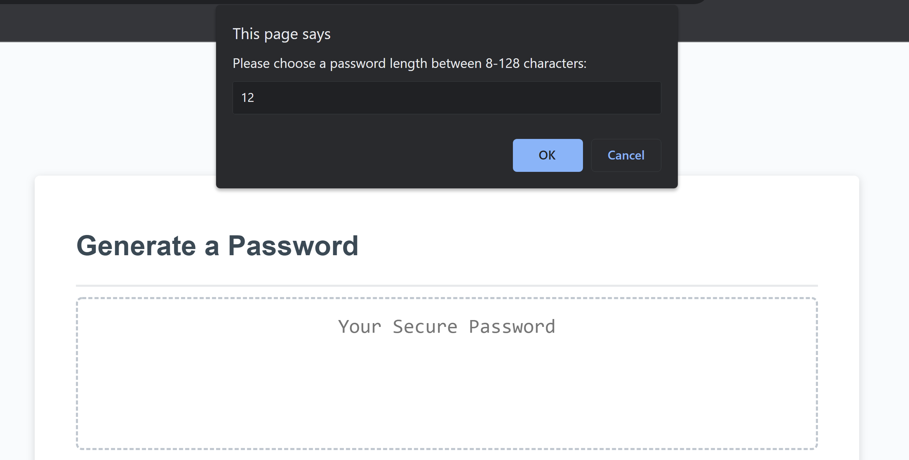
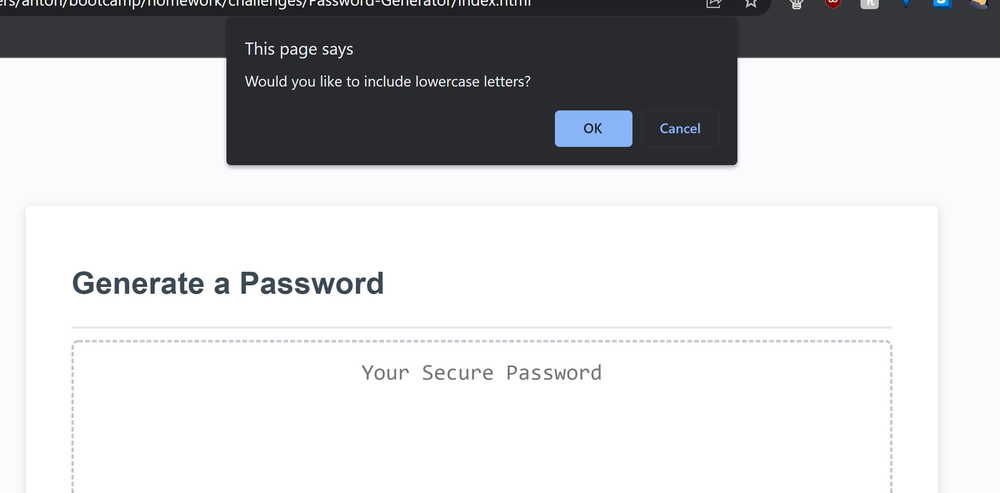
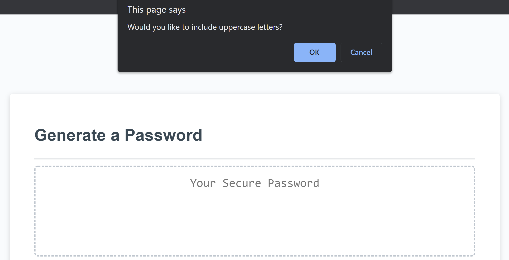
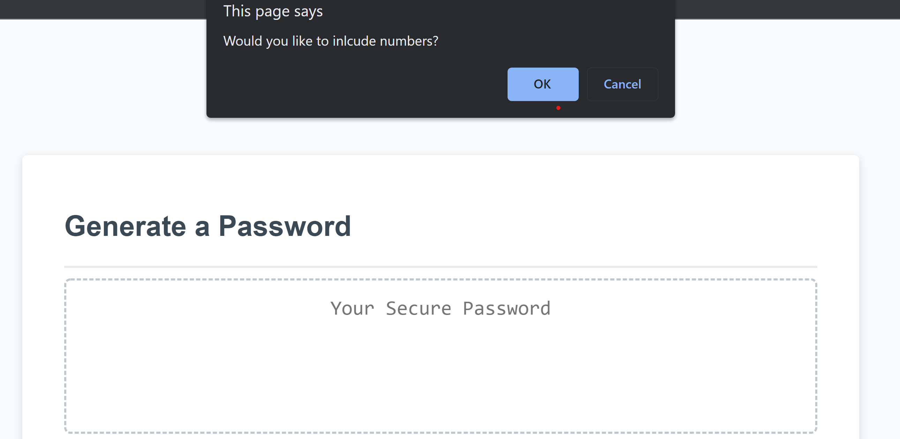
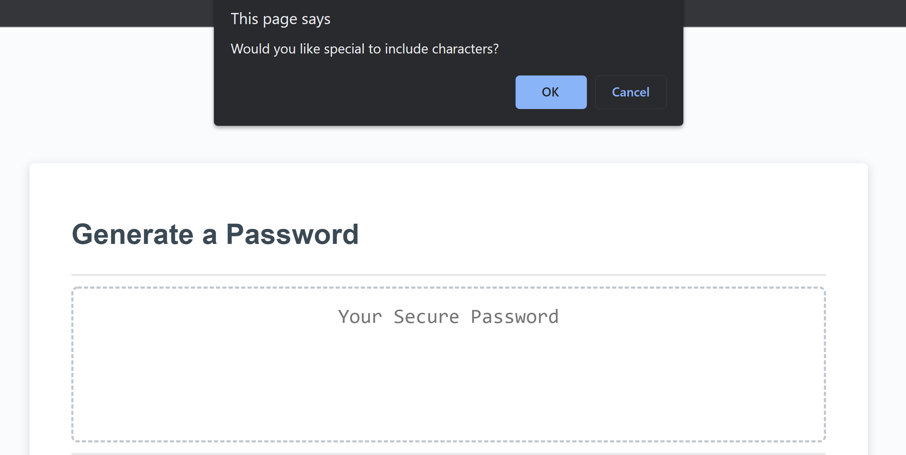
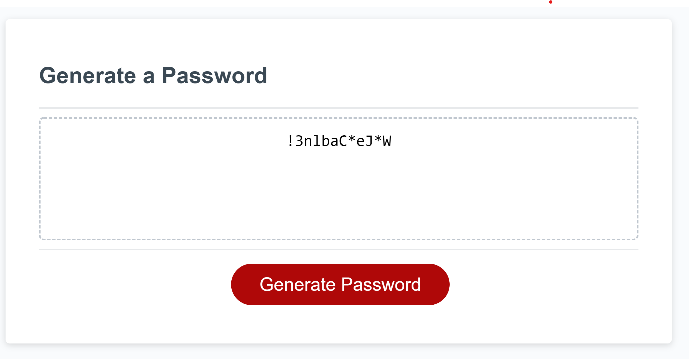

# Password Generator

This password generator takes input from the user to generate a password.
The user can choose a password's length between 8 and 128 characters. They can
also choose whether the password will consist of lowercase, uppercase, special, and/or numerical characters.

## Usage/Examples

By pressing the Generate button, the user will be showed prompts.
These prompts will let the user determine the length of the password between 8-128 characters. An alert will confirm the length of characters chosen.

The following prompt will ask if the user would like lowercase letters. OK will add lowercase letters, cancel will not.

The following prompt will ask if the user would like uppercase letters. OK will add uppercase letters, cancel will not.

The following prompt will ask if the user would like special characters. OK will add special punctuation, cancel will not.

The following prompt will ask if the user would like numbers. OK will add numbers, cancel will not.

If they user does not choose OK for any of the prompts, then they will be instructed by an alert that they need to choose at least one prompt.
The password will then be generated in the text box on the html page.

